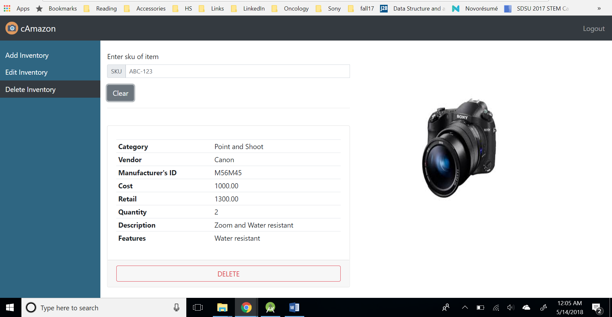
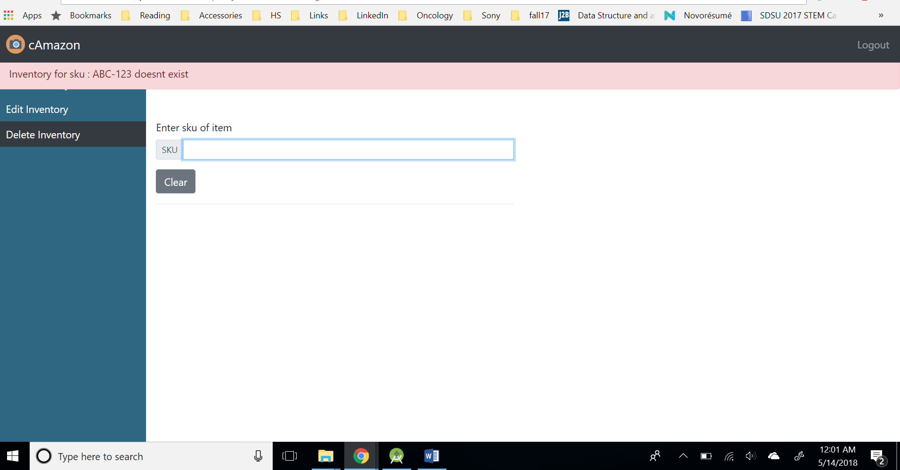
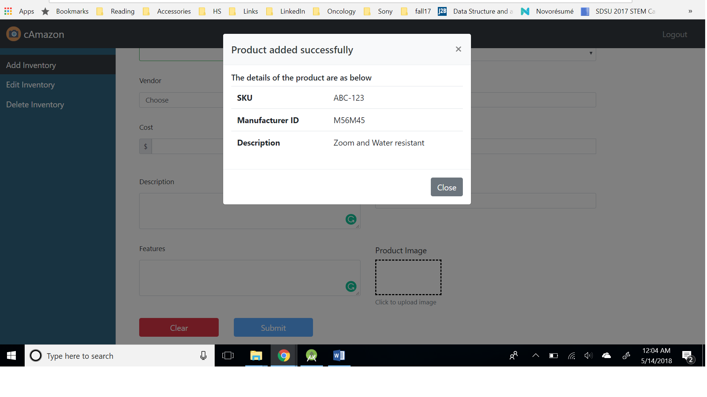
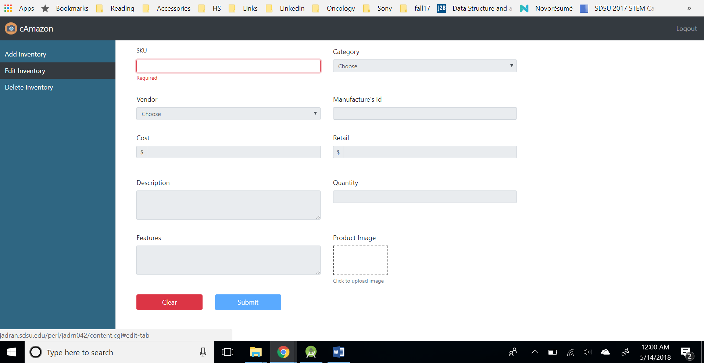

# CameraStore Inventory

## Contributors
 Pradeep Devarabetta Mallikarjun

## Synopsis
 An online single page web application that allows authorized employee to create inventory records for the new products.

## Work flow
  - Authorized user logs in to the website using the login page.
  - After logging in, the user is directed to the main page where the user can add new records, modify existing or delete records from the inventory.
  - The user will be logged out automatically after the timeout.
  - User has an option to logout once the inventory update is done.
  
## Technologies 
 - UI: HTML5, CSS, Bootstrap, JQuery, Javascript 
 - Core: AJAX, MySQL, REST, Perl 

## Screenshots

  
  
    
  
  
## License
MIT